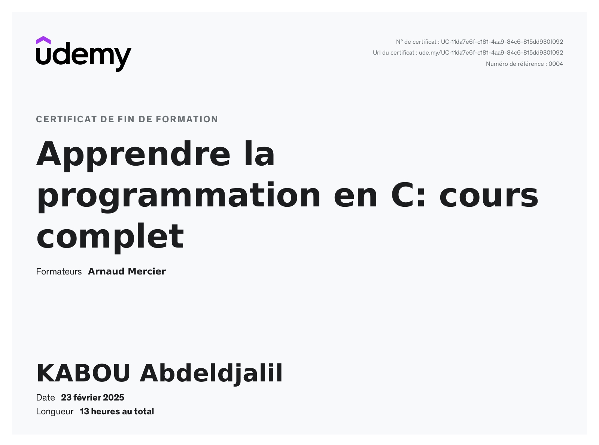
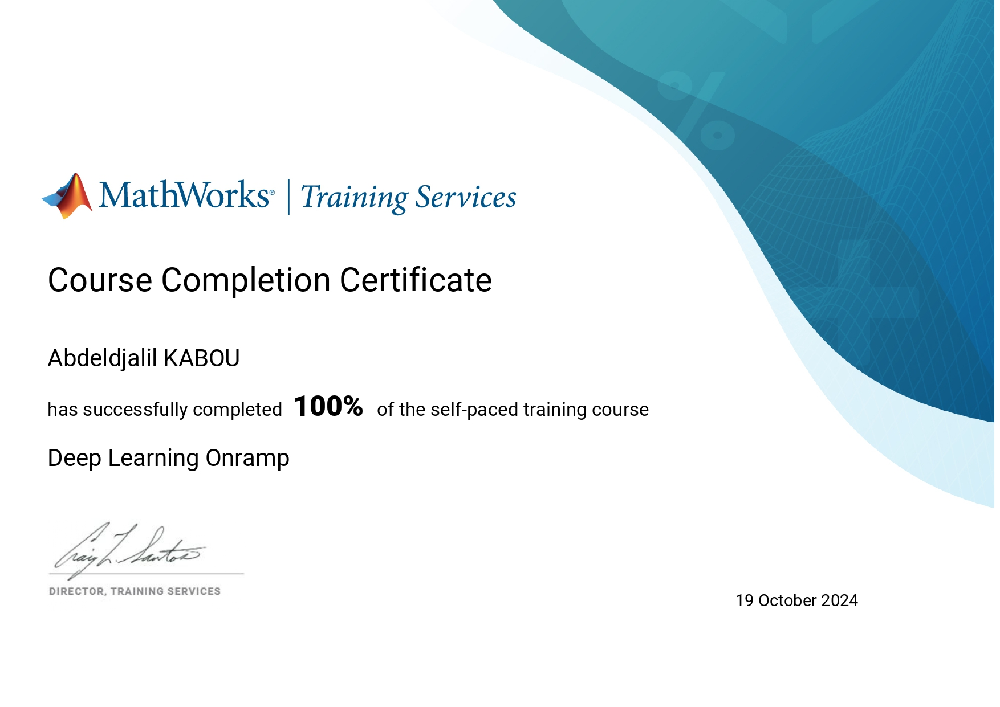
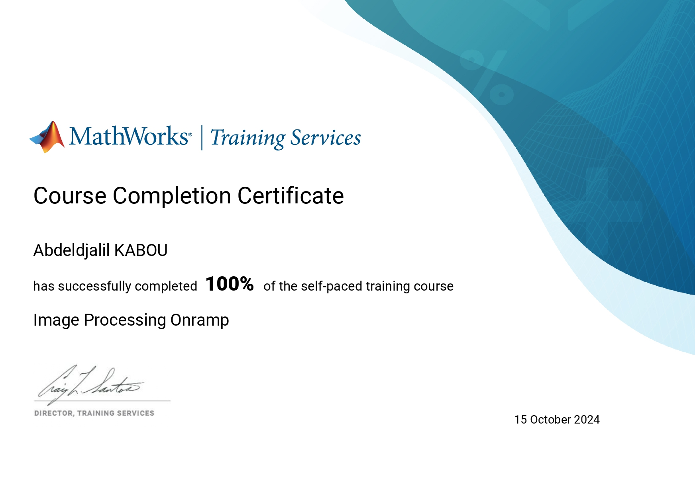
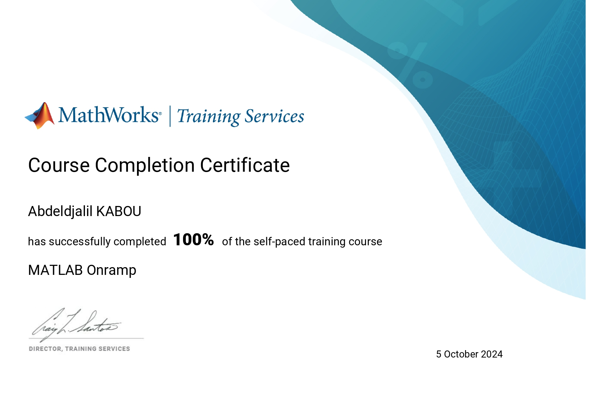

#  Online Courses – Continuous Learning Repository

This repository contains the online courses I have completed.

Each folder corresponds to one specific course and includes:

- Source code provided or developed during the training
- Practical exercises
- Solutions or corrections (when available)
- Course-related materials

The programs included in each folder follow the course content and were created as part of the training process.

##  Included Courses

- C Programming (Udemy)

##  Certificates

The certificates of completion for each course are available below:

#### C Programming – Udemy

  

#### Computer Vision Onramp – MathWorks

  

#### Deep Learning Onramp – MathWorks

  

#### Image Processing Onramp – MathWorks

  

#### Machine Learning Onramp – MathWorks

  

#### MATLAB Onramp – MathWorks

  

#### Signal Processing Onramp – MathWorks

  

### Statistics Onramp – MathWorks

  

